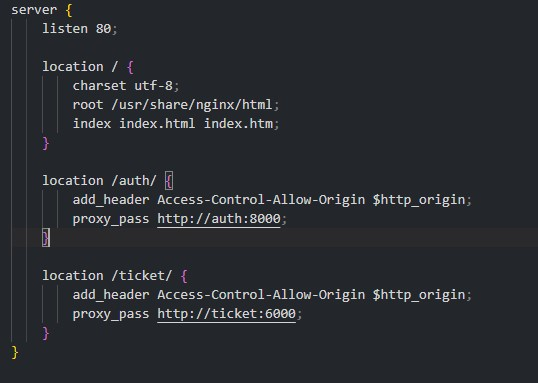
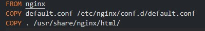
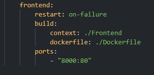
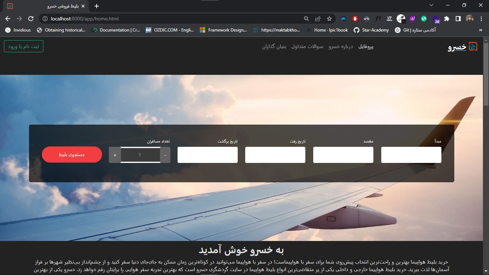
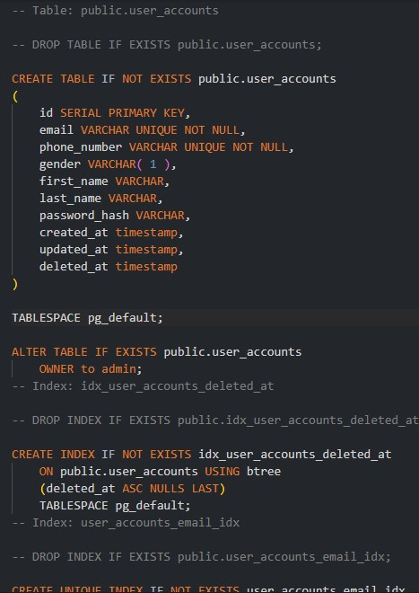
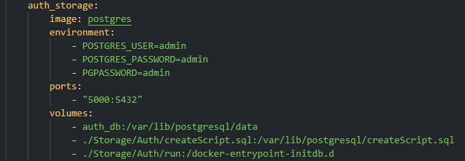
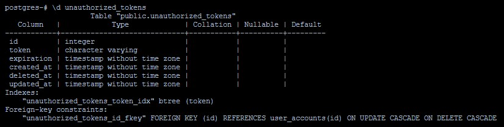
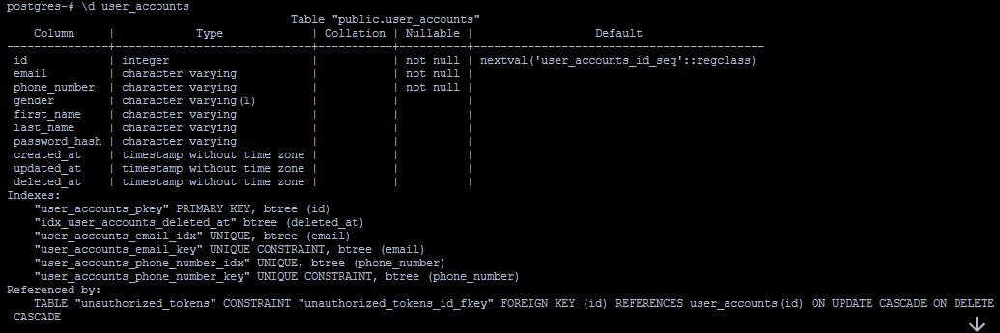
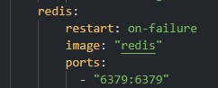
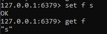

# web-hw3

- Alireza Farshi (99101976)
- Mohammad Khalafi (99105418)
- Abolfazl Ghalandary (99102026)

# Step 1 - Frontend

### configure default.conf file

### configure dockerfile

### configure docker compose file

### Result
using "docker-compose up" command:

# Step 2 - Storage services

## auth storage
### create script for table initialization

### create shell file

### configure docker compose file

### Result
By entering container terminal and using psql:

## auth cache

### configure docker compose

### Result
By using redis cli:

## ticket storage

