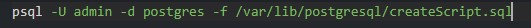
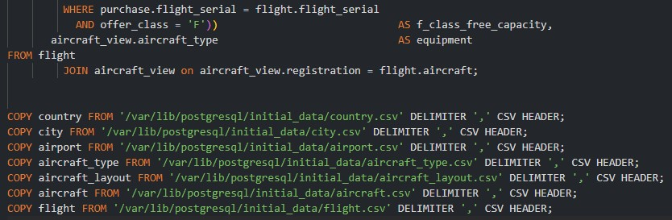

# web-hw3

- Alireza Farshi (99101976)
- Mohammad Khalafi (99105418)
- Abolfazl Ghalandary (99102026)

# Step 1 - Frontend

### configure default.conf file

### configure dockerfile

### configure docker compose file

### Result
using "docker-compose up" command:

# Step 2 - Storage services

## auth storage
### create script for table initialization

### create shell file

### configure docker compose file

### Result
By entering container terminal and using psql:

## auth cache

### configure docker compose

### Result
By using redis cli:

## ticket storage

### create script for table initialization

### create shell file

### configure docker compose file

### Result
By entering container terminal and using psql:

# Step 3 - Backend services
## auth service

First step is to rewrite hardcoded addresses by service names, then:

### configure Dockerfile

### configure docker-compose

### Result
By using Postman:

## ticket service

First step is to rewrite hardcoded addresses by service names, then:

### configure Dockerfile

### configure docker-compose

### Result
By using Postman:

# Step 4 - Docker Compose

We used docker compose from the first. So now we will have all the project ready by 'docker-compose up' command.

# Step 5 - Load Test

### locustfile configuration

### open locust web interface and start test

### Result

